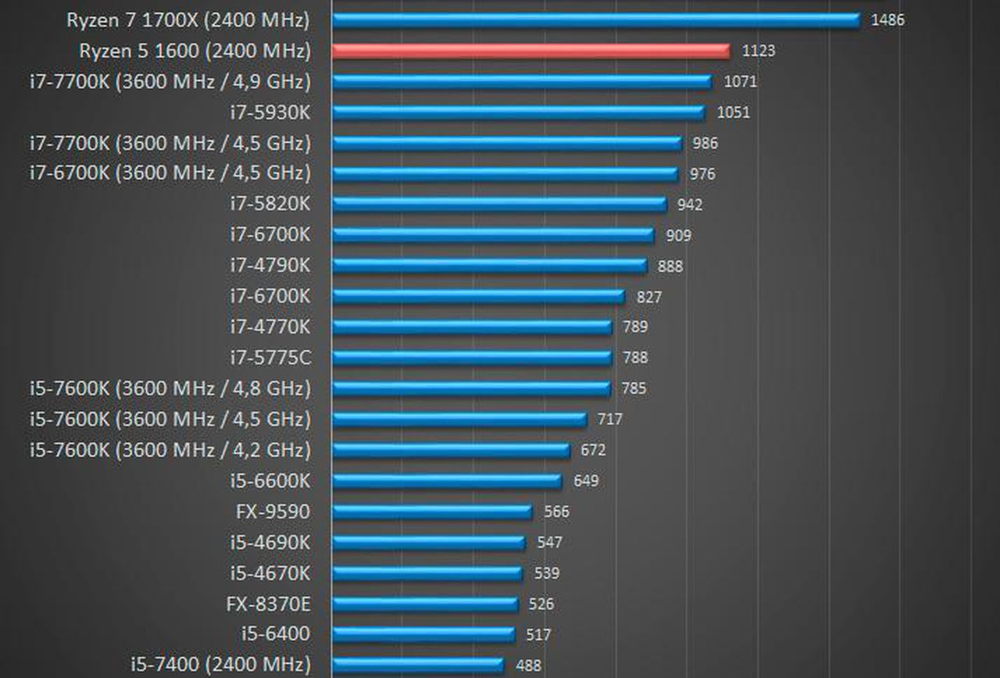
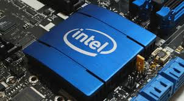
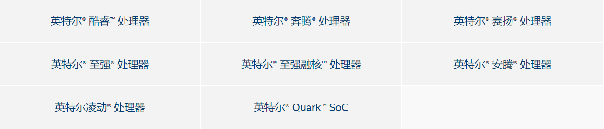
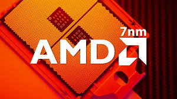
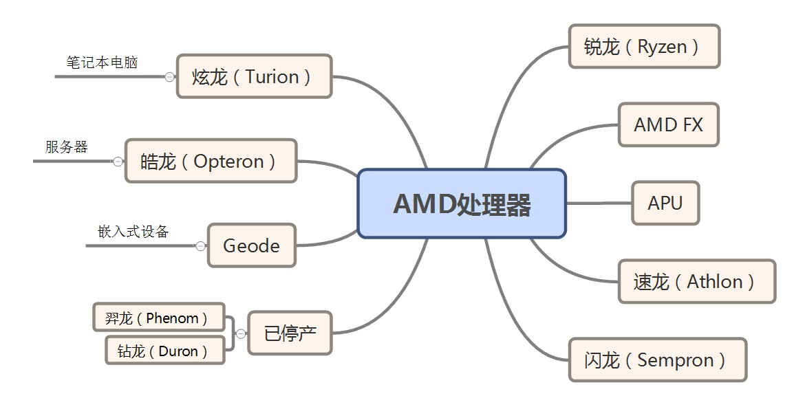
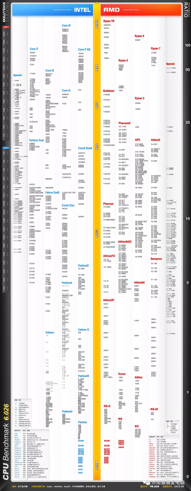
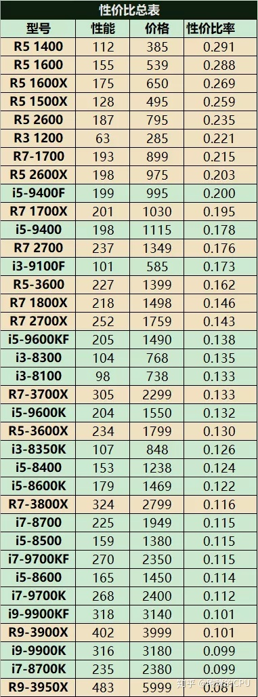

# CPU

---

## Brief Introduction

>_中央处理器，Central Processing Unit，是计算机的主要设备之一，功能主要是解释计算机指令以及处理计算机软件中的数据_

## Key Indicators
1. 主频，倍频，外频
>_主频也就是CPU的时钟频率，即CPU Clock Speed，也是CPU运算时的工作频率。一般说来，主频越高，一个时钟周期里面完成的指令数也越多，速度也就越快。至于外频就是系统总线的工作频率；而倍频则是指CPU外频与主频相差的倍数。三者是有十分密切的关系的：主频=外频x倍频_

2. 内存总线速度

>_Memory-Bus Speed，是指CPU与内存之间的通道棗内存总线的速度，对整个系统性能非常重要_

3. 扩展总线速度

>_Expansion-Bus Speed，是指安装在微机系统上的局部总线如VESA或PCI总线，这些CPU联系这些外部设备的桥梁的速度_

4. 工作电压

>_Supply Voltage，是CPU正常工作所需的电压，如果CPU发热量太大，寿命会极度减短，所以随着CPU的制造工艺与主频的提高，近年来各种CPU的工作电压有逐步下降的趋势，以解决发热过高的问题_

5. 超标量
>_衡量在一个时钟周期内CPU可以执行一条以上的指令的指标_

6. 数据总线宽度
>_数据总线负责整个系统的数据流量的大小，而数据总线宽度则决定了CPU与二级高速缓存、内存以及输入/输出设备之间一次数据传输的信息量_

  

## Vendors

#### __Intel__

  

- ___针对不同的需求，Intel推出了多种类型的CPU细分市场,主要有以下七种___

  

1. 酷睿(Core)
> _面向中高端消费者、工作站和发烧友的一系列CPU_

2. 奔腾(PenTIum)
> _比低端入门型的赛扬系列高一级，比横贯中高端主流型和高端旗舰型的酷睿系列低一级的中端入门型级别CPU_

3. 赛扬(Celeron)
> _经济型产品,其定位是低端，比奔腾低一级_

4. 至强(Xeon)
> _主要供服务器及工作站使用，亦有超级计算机采用此处理器_

5. 安腾(Itanium)
> _主要用于企业级服务器与高性能运算系统_

6. 凌动(Atom)
> _属于超低电压处理器系列，市场定位是在于智能手机、平板电脑和低成本PC_

7. Quark SoC
> _属于32位x86 SoC和μCs系列，专为小尺寸和低功耗设备而设计，并面向包括可穿戴设备在内的新市场，虽然比 Atom处理器更慢，但体积和功耗更小_

#### __AMD__

  

- ___对于个人消费领域，最常见的是锐龙、AMD FX、APU、速龙和闪龙系列,对于企业级应用，主要对标 intel对应产品___

  

1. 锐龙（Ryzen）
> _x86微处理器品牌，AMD Zen微架构的微处理器产品之一，Ryzen系列的Ryzen3、5和7分别对标英特尔的同类产品Core i3、i5和i7_

2. AMD FX
> _x86桌上型处理器，是Bulldozer微架构的正式产物之一，Ryzen3未上市前，FX继续和Core i3竞争，对于i5和i7，FX的竞争力很弱_

3. 速龙(Athlon)
> _x86兼容微处理器的品牌，Athlon是第一颗达到千兆赫（GHz）速度的桌面处理器。,现在Athlon与Intel的Pentium系列竞争_ 

4. 闪龙(Sempron)
> _入门级微处理器，主要与=与英特尔公司的赛扬（Celeron）处理器竞争。截至2017年第一季度，闪龙被赛扬远远抛离，销量很低_

5. 炫龙(Turion)
> _64位移动式处理器，与英特尔的同类产品Pentium M及其继承者Intel Core竞争,用于多路服务器的领域上_

5. Geode 
> _针对低功耗应用所设计的x86处理器，其频率从400MHz到1GHz不等，主要应用于各种终端机、精简型终端机（Thin client）和移动数码设备（如PDA）_

6. 钻龙(Duron)
> _x86计算器平台微处理器，竞争对手是Intel的Celeron处理器，2004年停产Duron处理器，Duron正式走入历史。其市场地位由AMD公司推出的Sempron处理器接任_

#### Comparison

- Performance

  

- Cost-effective

  

## Comment

_在选购CPU的时候，要和现有的内存、显卡和主板匹配，适当的才是最好的_
- _频率要同步：即内存的核心频率要等于或稍大于CPU的外频。不要给内存加上它不能承受的高频率，否则是频率“过载”。频率“过载”后，内存将拒绝工作_
- _带宽要匹配：应该设法使内存的数据带宽跟CPU前端总线的带宽相等，否则，数据的传输能力将受制于带宽较低的那端_
- _主板要调控：因为以上两个条件有时是不可能同时能满足的。这就要靠主板来调控，调控的主要方法是异步设臵_
### reference

- [英特尔® 产品规范](https://ark.intel.com/content/www/cn/zh/ark.html)

- [AMD® 产品规范](https://www.amd.com/zh-hans/products/specifications)

- [中央处理器 - 百科](https://zh.wikipedia.org/wiki/%E4%B8%AD%E5%A4%AE%E5%A4%84%E7%90%86%E5%99%A8)

- [2019年8月CPU和显卡性能天梯图](https://mp.weixin.qq.com/s/l9J2IUBAukfJXs8sYtVaYw)

- [全平台CPU性价比总表（2019.7.28）](https://zhuanlan.zhihu.com/p/82581264)

- [How to Choose the Right Processor and Motherboard](https://gizmodo.com/how-to-choose-the-right-processor-and-motherboard-1793033440)
