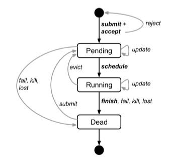
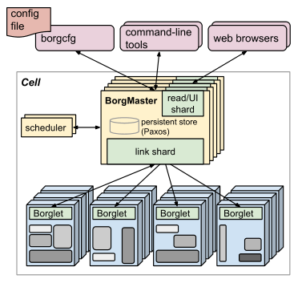
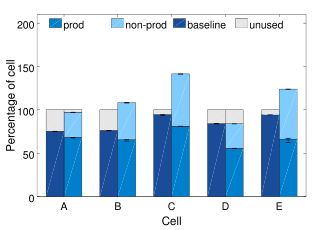
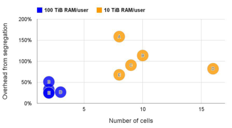
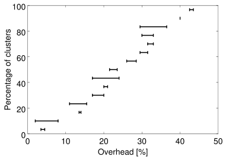
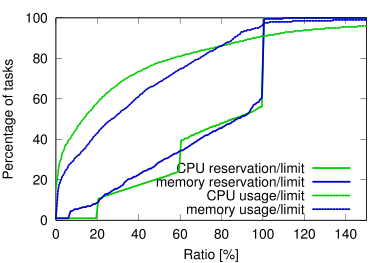
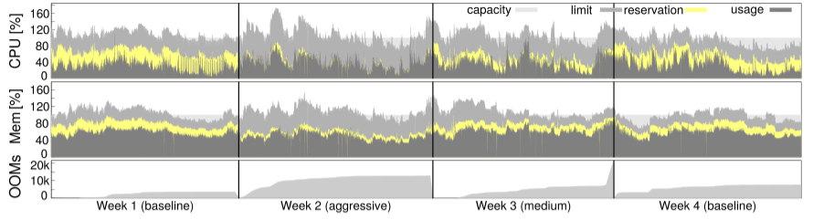

# Large-scale cluster management at Google with Borg

## 一、主要内容
> &emsp;&emsp;谷歌的Borg系统集群管理器运行了几十万个以上的jobs，来自不同的应用，横跨了多个集群，每个集群上都有上万台机器。

&emsp;&emsp;Borg提供了三个主要的好处：
* 隐藏资源管理和故障处理细节，使其用户可以专注于应用开发
* 高可靠性和高可用性的操作，并支持应用程序做到高可靠高可用
* 让我们在数以万计的机器上有效运行

&emsp;&emsp;Borg解决超大型集群的问题
* 管理、调度、开始、重启和监控谷歌运行的应用程序的生命周期。
* 保证集群的高利用率。
* 保证高度的可用性。
* 保证搞得可扩展性

> Borg的用户: 谷歌开发人员和系统管理员(网站可靠性工程师 SRE)。户运行谷歌应用与服务，以job的方式提交他们的工作给Borg。job由一个或多个task组成，每个task含有同样的二进制程序。一个job只能在一个Borg的Cell里面跑，Cell是包括了多台机器的单元。

## 二、 Borg的用户视角

### 1. 工作负载
* 长期服务(long-running)
&emsp;&emsp;长期服务，应该“永远”运行下去，并处理短时间的敏感请求（几微秒到几百毫秒）。这种服务是面向终端用户的产品如Gmail、Google Docs、网页搜索，内部基础设施服务（例如，Bigtable）。

* 批处理任务(batch jobs)
&emsp;&emsp;第二种是批处理任务，需要几秒到几天来完成，对短期性能波动不敏感。

&emsp;&emsp;在一个Cell上混合运行了这两种负载，取决于他们的主要租户（比如说，有些Cell就是专门用来跑密集的批处理任务的）。工作负载也随着时间会产生变化：批处理任务做完就会终止退出，终端用户服务的负载是以天为周期而波动运行的。Borg需要把这两种情况都处理好。

### 2. job & task

* job 优先级：高优先级的Borg的jobs定义为生产(prod)，剩下的是非生产的(non-prod)。大多数长期服务是prod的，大部分批处理任务是non-prod的。
* 一个Borg的job的属性有：名字、拥有者和有多少个task。
* job可以有一些约束，来指定这个job跑在什么架构的处理器、操作系统版本、是否有外部IP。约束可以是硬的或者软的。一个job可以指定在另一个job跑完后再开始。一个job只在一个Cell里面跑。
* 每个task包括了一组linux进程，跑在一台机器的一个容器内。
* task也有一些属性，包括资源用量，在job中的排序。大多task的属性和job的通用task属性是一样的，也可以被覆盖。 例如，提供task专用的命令行参数，包括CPU核、内存、磁盘空间、磁盘访问速度、TCP端口等等，这些都是可以分别设置并按照一个好的粒度提供。
* 用户通过RPC来操作Borg的job。
* job和task的生命周期，如图。用户可以在运行时改变一个job中的task的属性，通过推送一个新的job配置给Borg。

&emsp;&emsp;&emsp;

### 3. 优先级、配额和管理控制

&emsp;&emsp;优先级和配额的方案用来处理运行时负载超载的情况。

* 所有job都有优先级，一个小的正整数，高优先级的task可以优先获取资源。Borg定义了不重叠的优先级段给不同任务用。
* 为了避免连锁降级反应，禁止了prod级task互相排挤。同样的，在其他场景下，也可以通过合理粒度的优先级来避免这类情况的发生。
* 优先级是jobs的相对重要性，决定了jobs在一个cell里面是跑还是等(pending)。配额则是用来决定jobs是否运行被调度。配额就是，在一个指定的优先级、一个指定的时间段(月这个量级)，一组资源(CPU, RAM, disk)的数量。数量决定了这个用户的job可以用的最多资源。配额检查是管理控制的一部分，不是调度层的：配额不足的任务在提交的时候就会被拒绝。 
* 高优先级的配额总是消费的比低优先级要多。prod级的配额是被限制为一个cell里面实际的资源量，所以用户提交了prod级的job的配额时，在不计资源碎片和限制之外，可以期待这个job一定会跑。
* 用户jobs只在有足够配额和足够优先级之后才能启动。

### 4. BNS
&emsp;&emsp;为了方便创建、部署、查找和管理task，
Borg创造了一个稳定的“Borg name Service”(BNS) 名字给每个task。这个名字包括了cell名字，job名字，和task编号。BNS名称也是task的DNS名的基础构成部分。

&emsp;&emsp;几乎所有的Borg的task都会包含一个内置的HTTP服务，用来发布健康信息和几千个性能指标(例如RPC延时)。Borg监控这些健康检查URL，把其中响应超时的和error的task重启。

## 三、 Borg架构
&emsp;&emsp;一个Borg的Cell包括一堆机器，一个逻辑的中心控制服务叫做Borgmaster，和在每台机器上跑的Borglet的agent进程。

&emsp;&emsp;

### 1. Borgmaster
* Cell的Borgmaster由2个进程组成，主的Borgmaster进程和一个单独的scheduler
* 主的Borgmaster处理所有客户端的RPC请求,同时管理系统中所有组件的状态机，和Borglet通信。
* Borgmaster在逻辑上是一个单进程，但实际上开了5个副本。为了好得容错性。

### 2. schedule
* schedule流程

&emsp;&emsp;当一个job被提交的时候，Borgmaster会把它持久化的存储在Paxos存储上，然后把这个job的task放到等待(pending)的队列里面去。这个队列会被scheduler异步的扫描，然后分发task到有充足资源的机器上。scheduler主要是处理task的，不是job``。扫描从高优先级到低优先级，在同个优先级上用round-robin的方式处理，以保证用户之间的公平性和避免头上的大job阻塞住。调度算法有2个部分：可行性检查(feasibility checking)，找到一台能跑task的机器，和打分(scoring)，找个一个最合适的机器。 

* 可行性检查

&emsp;&emsp;在可行性检查这个阶段，scheduler会找到一组机器，都满足task的约束而且有足够可用的资源 —— 包括了一些已经分配给低优先级任务的可以被腾出来的资源。在打分阶段，scheduler会找到其中“最好”的机器。这个分数包括了用户的偏好，但主要是被内置的标准：例如最小化的倒腾其他task，找到已经有这个task安装包的，在电力和出错的可用域之间尽可能分散的，在单台机器上混合高低优先级的task以保证高峰期扩容的。

* 打分

&emsp;&emsp;E-PVM的变种算法：在实践中，E-PVM最后把负载平均分配到所有机器，把扩展空间留给高峰期 —— 但这么做的代价是增加了碎片，尤其是对于大的task需要大部分机器的时候。

&emsp;&emsp;“最佳匹配”：把机器塞任务塞的越紧越好。这样就能留下一些空的机器给用户jobs(他们也跑存储服务)，所以处理大task就比较直接了，不过，紧分配会惩罚那些对自己所需资源预估不足的用户。这种策略会伤害爆发负载的应用。 

&emsp;&emsp;Borg目前的打分模型是以上两个策略的混合，试图减少碎片资源，同时保证负载均衡。

* 选择

&emsp;&emsp;如果一台机器在打分后没有足够的资源运行新的task，Borg会驱逐(preempts)低优先级的任务，从最低优先级往上踢，直到资源够用。并且，把被踢掉的task放到scheduler的等待(pending)队列里面去，而不是迁移或冬眠这些task。 

* 启动延迟

&emsp;&emsp;task启动延迟: 从job提交到task运行之间的时间段，一般来说是25s，但有很大的差异。包安装耗费了这里面80%的时间：一个已知的瓶颈就是对本地硬盘的争抢。为了减少task启动时间，scheduler希望机器上已经有足够的包(程序和数据)：大部分包是只读的所以可以被分享和缓存。这是唯一一种Borg scheduler支持的数据本地化方式。

### 3. Borglet
* Borglet是部署在cell的每台机器上的本地Borg代理程序。
* 它启动停止task，如果task失败就重启。
* 通过修改OS内核设置来管理本地资源。
* 滚动debug日志
* 把本机的状态上报给Borgmaster和其他监控系统。

### 4. 可扩展性

&emsp;&emsp;一个单独的Borgmaster可以管理一个cell里面几千台机器，若干个cell可以处理10000个任务每分钟。一个繁忙的Borgmaster使用10-14个CPU核以及50GB内存。Borg用了几项技术来获得这种扩展性。

* 为了改进响应时间，我们增加了一些独立线程和Borglet通信、响应只读RPC。
* 分数缓存：评估一台机器的可用性和分数是比较昂贵的，所以Borg会一直缓存分数直到这个机器或者task变化了。
* 同级别均化处理：同一个Borg job的task一般来说有相同的需求和资源，所以不用一个个等待的task每次都去找可用机器，这会把所有可用的机器打n次分。Borg会对相同级别的task找一遍可用机器打一次分。 
* 适度随机：把一个大的Cell里面的所有机器都去衡量一遍可用性和打分是比较浪费的。所以scheduler会随机的检查机器，找到足够多的可用机器去打分，然后挑出最好的一个。

## 三、 可用性
&emsp;&emsp;在大型分布式系统里面故障是很常见的]。在Borg上跑的应用需要能处理这种事件，应用要支持开副本、存储数据到分布式存储这些技术，并能定期的做快照。同时，也要尽可能的缓和这些事件造成的性能上的影响。
* 自动的重新调度被驱逐的task，如果需要放到新机器上运行。
* 通过把一个job分散到不同的可用域里面去，例如机器、机架、供电域 
* 在机器、OS升级这些维护性工作时，降低在同一时刻的一个job中的task的关闭率 
* 使用声明式的目标状态表示和幂等的状态改变做操作，这样故障的客户端可以无损的重新启动或安全的遗忘请求 
* 对于失联的机器上的task，限制一定的比率去重新调度，因为很难去区分大规模的机器故障和网络分区 
避免特定的会造成崩溃的task:机器的匹配 
* critical级别的中间数据写到本地硬盘的日志保存task很重要，就算这个task所属的alloc被终止或调度到其他机器上，也要恢复出来做。用户可以设置系统保持重复尝试多久：若干天是比较合理的做法。

&emsp;&emsp;一个关键的Borg设计特性是：就算Borgmaster或者Borglet挂了，task也会继续运行下去。不过，保持master运行也很重要，因为在它挂的时候新的jobs不能提交，或者结束的无法更新状态，故障的机器上的task也不能重新调度。 

&emsp;&emsp;Borgmaster使用组合的技术在实践中保证99.99%的可用性：副本技术应对机器故障；管理控制应对超载；部署实例时用简单、底层的工具去减少外部依赖。每个cell和其他cell都是独立的，这样减少了误操作关联和故障传染。

## 四、使用效率
&emsp;&emsp;Borg的一个主要目的就是有效的利用Google的机器舰队。

### 1. Cell的共享使用 

&emsp;&emsp;图中展现了在一个中等大小的Cell上分开跑prod和non-prod的工作负载将需要20-30%多的机器。这是因为prod的job通常会保留一些资源来应对极少发生的负载高峰，但实际上在大多情况下不会用这些资源。Borg把这批资源回收利用了来跑很多non-prod的工作，所以最终只需要更少的机器。 

&emsp;&emsp;

&emsp;&emsp;大部分Borg cell被几千个用户共享使用。下图展现了为什么。如果一个用户消费超过了10TiB内存(或100TiB)，就把这个用户的工作负载分离到一个单独的Cell里面去。即使我们设置了这么高的阈值(来分离)，也需要2-16倍多的Cell，和20-150%多的机器。资源池的方案再次有效地节省了开销。

&emsp;&emsp;

&emsp;&emsp;通过实验得出了共享并没有显著的增加程序运行的开销。 共享是有益的：比起CPU的降速，在各个方案里面减少机器更重要，这会带来减少所有资源的开销，包括内存和硬盘，不仅仅是CPU。

### 2. 大Cell 
* Google建立了大Cell，为了允许大的任务运行，也是为了降低资源碎片。

### 3. 资源请求粒度 
* Borg用户请求的CPU单位是千分之一核，内存和硬盘单位是byte。

* 提供一个固定尺寸的容器和虚拟机不符合Borg的需求。

### 4. 资源再利用

&emsp;&emsp;一个job可以声明一个 限制资源 ，是每个task能强制保证的资源上限。Borg会先检查这个限制是不是在用户的配额内，然后检查具体的机器是否有那么多资源来调度这个task。
&emsp;&emsp;但有些task要求的资源为自己预留了空间，所以Borg会估计了一个task会用多少资源，然后把其他的资源回收再利用给那些可以忍受低质量资源的工作，这整个过程被叫做资源再利用(resource reclamation)。

&emsp;&emsp;一台机器有可能因为自留地预估错度而导致运行时资源不足 —— 即使所有的task都在 限制资源 之内跑。如果这种情况发生了，Borg会杀掉或者限制non-prod task，从来不对prod task下手。 

&emsp;&emsp;下图展示了如果没有资源再利用会需要更多的机器。在一个中等大小的Cell上大概有20%的工作负载跑在回收资源上。 

&emsp;&emsp;

&emsp;&emsp;下图可以看到更多的细节，包括回收资源、实际使用资源和 限制资源 的比例。一个超内存限制的task首先会被重新调度，不管优先级有多高，所以这样就很少有task会超过内存限制。另一方面，CPU使用率是可以轻易被卡住的，所以短期的超过自留地资源的高峰时没什么损害的。 

&emsp;&emsp;

&emsp;&emsp;在自留地和实际使用中间有一大片差距。为了测试这一点，Borg选择了一个cell然后调试它的预估参数，把安全区划小点，然后做了一个介于激进和基本之间的中庸策略跑，然后恢复到基本策略。 

&emsp;&emsp;下图展现了结果。第二周自留地资源和实际资源的差值是最小的，比第三周要小，最大的是第一和第四周。和预期的一样，周2和周3的OOM率有一个轻微的提升。这是一个trade-off，对于Borg来说利大于弊，于是Borg把中庸策略的参数放到其他cell上部署运行。

&emsp;&emsp;

## 五、隔离性

&emsp;&emsp;一台机器上会同时跑很多task，需要一个比较好的机制来保证task之间不会相互冲突，包括安全和性能都不能相互冲突。

### 1. 安全隔离

&emsp;&emsp;Borg使用Linux chroot作为同一台机器不同task之间主要的安全隔离机制。为了允许远程debug，Borg提供borgssh命令，这个程序和Borglet协同，来构建一个ssh shell，这个shell和task运行在同样的chroot和cgroup下，这样限制就更加严格了。 

&emsp;&emsp;同时，VM和安全沙箱技术被使用在外部的软件上。
### 2. 性能隔离
* 所有Borg task都跑在Linux cgroup-based资源容器里面，Borglet操作这些容器的设置，这样就增强了控制。

* 为了搞定超负荷和超请求，Borg task有一个应用阶级(appclass)。

* Borglet的用户空间控制循环在未来预期的基础上给prod task分配内存，在内存压力基础上给non-prod task分配内存；从内核事件来处理Out-of-Memory (OOM)；杀掉那些想获取超过自身限制内存的task。

## 六、思考

&emsp;&emsp;Google内部不仅像计算型的应用，比如MapReduce、Pregel等运行在Borg上，存储类的应用，比如GFS，BigTable和Megastore等也运行在上面，真正做到了批处理作业和长周期服务的混合部署和资源动态调度。

&emsp;&emsp;Borg系统其实可以看做是集中式的调度器，因为其调度的对象是task，master负责调度和通信工作。它的设计需要考虑到集群、调度、性能、安全性、隔离性，最不能忽视的就是资源。

&emsp;&emsp;Borg中资源超售机制的提出，这种机制的提出能够显著提高系统的资源利用率，其实对于目前来说，调度系统内部Borg已经可以做的比较优了，唯一的问题就是对于一个任务Borg无法预知到该任务真正需要多少资源，这就导致了在资源分配的时候造成大量资源闲置和浪费。而资源超售可以很好的解决这个问题。