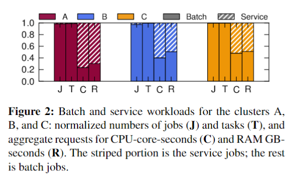
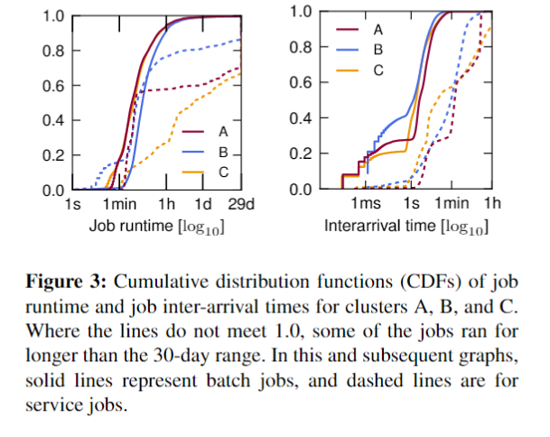
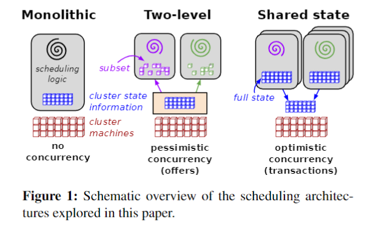
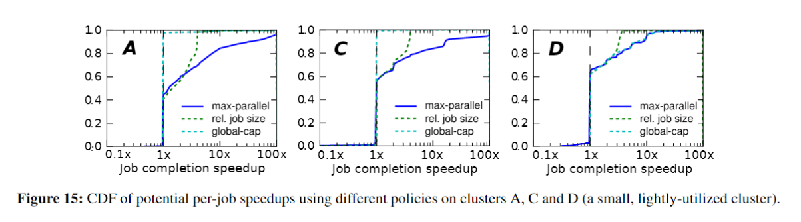
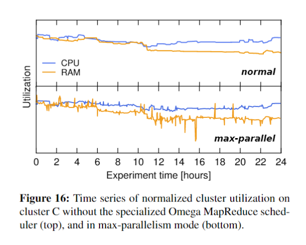

## Omega: flexible, scalable schedulers for large compute clusters

---

### 目标问题

_在大规模的集群中,当前的单一集群调度器体系结构把所有任务运行在一台机器上,随着集群规模的增大,需要调度的任务的规模也线性增大,这限制了新特性的部署速度,降低了效率和利用率,也限制了集群的增长._

 

 

_这篇论文正是为了充分利用硬件资源,设计了可扩展的高性能的调度系统,可以满足:_

- 硬件资源高利用率
- 用户自定义调度策略
- 快速调度决策过程及兼顾各层面的公平调度

### 核心思想

_论文围绕资源状态共享的思想,多个并发的调度进程以乐观锁的方式访问这些共享状态来获得调度框架的可扩展性,主要讨论了:_

1. 为集群调度开发提供轻量级的选择空间
2. 介绍一种基于乐观锁和共享状态的新型调度方法
3. 采用模拟和合成的负载来对比三种方法
4. 更进一步探索贡共享状态方式
5. 通过一个案例展示共享状态的灵活性

### 关键技术

#### 三种管理方法

 

- 中央式调度器(Monolithic scheduler)
_中央式调度器的特点是,资源的调度和作业的管理功能全部放到一个进程中完成,这种设计方式的缺点很明显,首先,集群规模受限；其次,新的调度策略难以融入现有代码中,比如之前仅支持MapReduce作业,现在要支持流式作业,而将流式作业的调度策略嵌入到中央式调度器中是一项很难的工作_

- 双层调度器(Two-level scheduler)
_双层调度器仍保留一个经简化的中央式调度器,但把调度策略下放到各个应用程序调度器完成.双层调度器的缺点是:_
_各个框架无法知道整个集群的实时资源使用情况.很多框架不需要知道整个集群的实时资源使用情况就可以运行的很顺畅,但是对于其他一些应用,为之提供实时资源使用情况可以为之提供潜在的优化空间_
_采用悲观锁,并发粒度小,会大大降低性能.在Mesos中,在任意一个时刻,Mesos资源调度器只会将所有资源推送给任意一个框架,等到该框架返回资源使用情况后,才能够将资源推动给其他框架,因此,Mesos资源调度器中实际上有一个全局锁,这大大限制了系统并发性_

- 共享状态调度器(Shared State Scheduler)
_为了克服双层调度器的以上两个缺点,是一种基于共享状态的调度器,该调度器将双层调度器中的集中式资源调度模块简化成了一些持久化的共享数据(状态)和针对这些数据的验证代码,而这里的“共享数据”实际上就是整个集群的实时资源使用信息.一旦引入共享数据后,共享数据的并发访问方式就成为该系统设计的核心,而Omega则采用了传统数据库中基于多版本的并发访问控制方式(也称为“乐观锁”, MVCC, Multi-Version Concurrency Control),这大大提升了Omega的并发性_

### 效果分析

 
 

可以看出,共享状态调度器使作业更快完成，集群资源利用的可变性也增加了.

### 论文总结

在Omega中，全局所有的资源对于各个调度进程来说都是可见的，各调度进程都有一份资源状态的拷贝，以此为基础来调度资源.资源可以根据任务的优先级被抢占，各调度进程也可以决定是否占用部分资源等.由于没有中央调度进程的存在，在一定程度满足了公平调度的需求，各个调度进程可以配置最大可调度资源和任务的上限.Omega是非常成功的设计.
